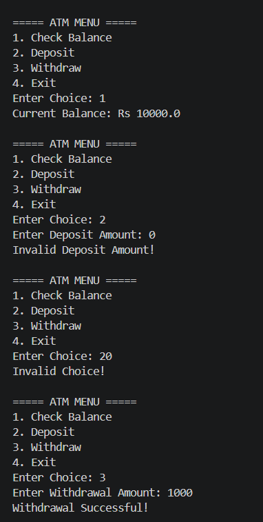

# ATM Machine System

## Overview
This is a simple Java-based ATM Machine project that simulates basic banking operations.

## Features
- Deposit Money
- Withdraw Money
- Check Account Balance
- Input Validation
- Simple Console-Based Interface

## Technologies Used
- Java
- Object-Oriented Programming (OOP)

## Concepts Implemented
- Classes & Objects
- Encapsulation
- Methods
- Conditional Statements
- User Input Handling

## How to Run
1. Clone the repository
2. Open the project in VS Code or any Java IDE
3. Compile and run the Java file

## Output

## Created By
Prabhneet Kaur
